# Missing Unicode Characters

This page lists the custom characters that I came across that are used in some Signum!
fonts but do not exist as Unicode characters. Adding these to the standard would be
necessary to fully convert the documents that use them.

## Misc

| Image | Name | Source |
| --- | --- | --- |
| 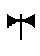 | AXE WITH TWO BLADES | ANTI_CS 0x47 |
| 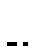 | SHORT LINE WITH DOT | HUDBA 0x61 |
| 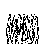 | WHITE NOISE | HUDBA 0x6e |

## Waveform drawings

| Image | Name | Source |
| --- | --- | --- |
| 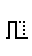 | HALF-WIDTH SQUARE WAVEFORM WITH DOTTED TRAILER | HUDBA 0x42 |
| 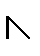 | REVERSED RAMP WAVEFORM | HUDBA 0x43 |
| 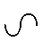 | FLIPPED SINE WAVE | HUDBA 0x4d |
| 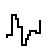 | DISTORTED SINE WAVEFORM | HUDBA 0x4e |
| 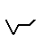 | FLIPPED ADSR WAVEFORM | HUDBA 0x59 |
| 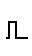 | HALF-WIDTH SQUARE WAVEFORM | HUDBA 0x62 |
| 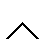 | TRIANGLE WAVEFORM | HUDBA 0x76 |
| 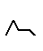 | ADSR WAVEFORM | HUDBA 0x79 |

## Musical Notation

| Image | Name | Source |
| --- | --- | --- |
| 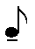 | EIGTH NOTE WITH BAR BELOW | HUDBA 0x65 |
| 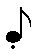 | EIGTH NOTE WITH DOT BELOW | HUDBA 0x77 |
