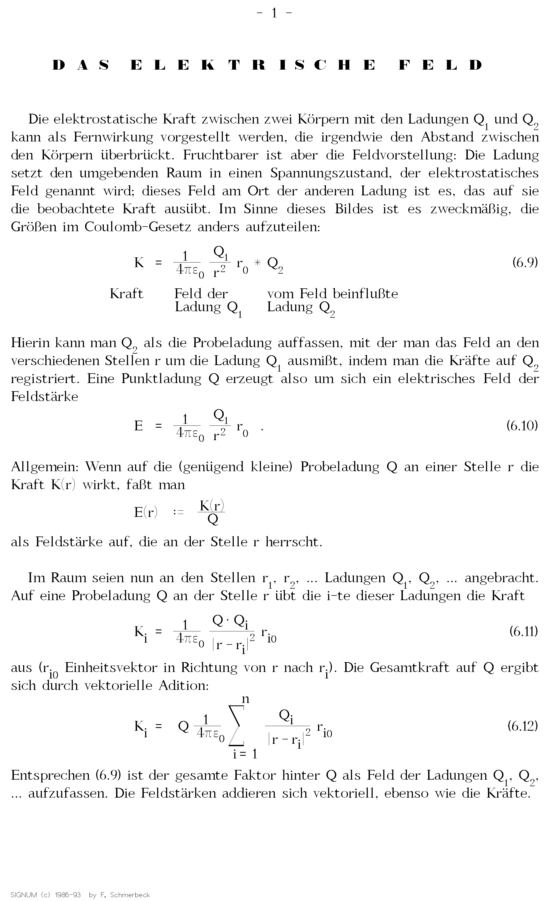

# Examples

There is a `PHYSIK.SDO` example file that comes with Signum!2, which uses different
fonts, multiple formulas and some character formatting. We can use this example to
demonstrate how a signum document is layed out and printed.

## Editor

This is a render of the document with the editor font, *without* skew compensation.
It has 108 DPI of vertical resolution and 90 DPI horizontal resolution, relative
to the theoretical paper model.

## Printer

This is a render of the document with a printer font, *with* skew-compensation,
so that the entire document is 324 DPI relative to the theoretical paper model.

