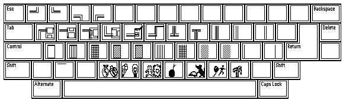
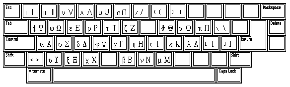
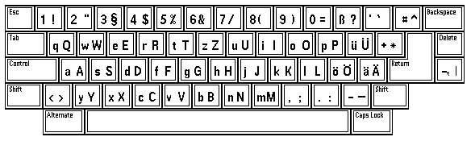
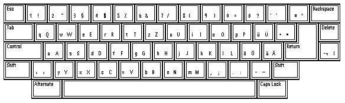
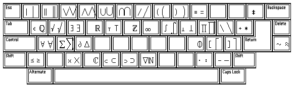
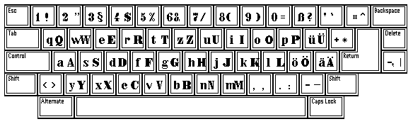
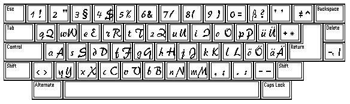

# Signum! Standard font mappings

This page contains information on how separate Signum! fonts map to characters
in [Unicode]. To allow me and other to automate that process, the mappings
are provided as `Format A` mapping tables, that specify a unicode code-point
for each character that can be mapped with its name and the character itself.

[Unicode]: https://unicode.org

See also: [E24 Charset Format](format-eset.html)

## ANTIKRO

<https://cdn.jsdelivr.net/gh/Xiphoseer/sdo-tool@main/mappings/ANTIKRO.TXT>

- 0xFF should be "HYPHEN WITH SMALL T"

## FRAKTUR1

## GRAPH1

## GRIECH

<https://cdn.jsdelivr.net/gh/Xiphoseer/sdo-tool@main/mappings/GRIECH.TXT>

- 0x37 should be "SMALL SOLIDUS" (0xFE67)
- 0x5B should be "SMALL LEFT SQUARE BRACKET"
- 0x5D should be "SMALL RIGHT SQUARE BRACKET"

## GROTFE

## GROTLT

## GROTMIKR

## MATHEM

## NORMANDE

## PINSEL

