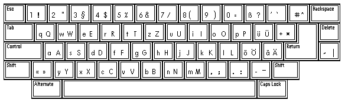
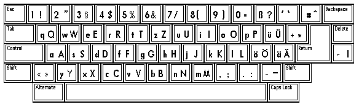
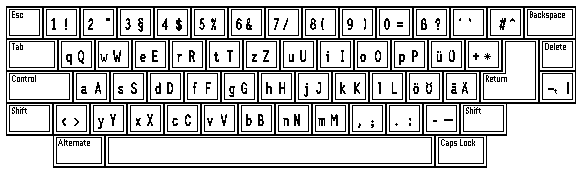
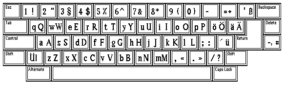
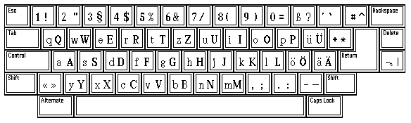
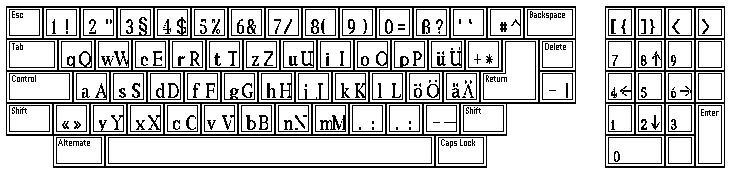

# Other fonts

This page contains some additional font mappings. Initially, all of these are just
the visual mapping images, but I hope to turn the more interesting ones into mapping
tables at some point.

## Random named fonts

These are some fonts I found in my collection

### BUBBLE

### FUTUR_09

### FUTUR_11

### GRA

Seems ot be an older version of the default `GRAPH1` font.

### GROTMED

### PRIS__11

### SCRIBA

### TIMES

## Random unnamed fonts

These are fonts that people on the internet collected

Source: <http://cd.textfiles.com/atarilibrary/atari_cd11/GRAFIK/SIGFONTS/>

### FONT_001

### FONT_002

### FONT_003

### FONT_004

### FONT_005

### FONT_006

### FONT_007

### FONT_008

### FONT_009

### FONT_010

### FONT_011

### FONT_012

### FONT_013

### FONT_014

### FONT_015

### FONT_016

### FONT_017

### FONT_018

### FONT_019

### FONT_020

### FONT_021

### FONT_022

### FONT_023

### FONT_024

### FONT_025

### FONT_026

### FONT_027

### FONT_028

### FONT_029

### FONT_030

### FONT_031

### FONT_032

### FONT_033

### FONT_034

### FONT_035

### FONT_036

### FONT_037

### FONT_038

### FONT_039

### FONT_040

### FONT_041

### FONT_042

### FONT_043

### FONT_044

### FONT_045

### FONT_046

### FONT_047

### FONT_048

### FONT_049

