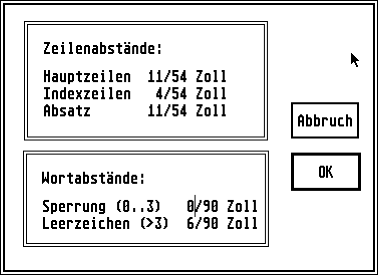
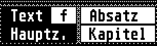
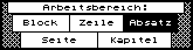

# Signum! Document

This page contains general information on the Signum! documents as they are
presented to the users. To learn more about the file format, have a look
a [this page](/formats/sdoc).

## Document

A document is made up of a sequence of **page**s. All of these have an internal
index that never changes once a page is added, so deleted pages appear as
gaps in a lookup-by-index table.

Each page also has a physical page number (a one-based ordinal for its
position in the current file) and a logical page number (one-based ordinal
for its position in a multi-file document).

Some pages could be marked as the start of a new **chapter**, which would
affect how the automatic formatting treated these.

## Page

Each page is made up of three sections, the header, the main content
area and the footer. If the footnote feature of Signum!2 was used, the
footer area would expand with the footnotes.

The page content is placed on a relatively granular grid, with different
vertical and horizontal resolution. Every unit of vertical resolution (line)
represents 1/54 of an inch, every unit of horizontal resolution (microstep)
represents 1/90 of an inch.

A line could have a maximum of 250 characters in *Signum!2* or 182 characters
in *Signum!1*[^1]. Characters are stored with their [font-modifiers](./font-modifiers.md),
their [character set](../chsets) and their offset from the left-edge of the
previous character.

[^1]: Signum!2 Handbuch, I 1.4 Kompatibilität zu Signum Version 1

In the editor, the height of a single line is two pixels and one horizontal
unit is a single pixel. That's a resolution of 108 dots-per-inch (DPI)
vertically and 90 dpi horizontally. It also means that a box that would appear
square in print will be less wide than tall in the editor. The characters
come from the `*.E24` font files and are up to 24px high and 16px wide (not
including modifiers).

The printing resolution depends on the kind of printer available, each of
which have their respective associated font formats. The 24-needle printers
use the `*.P24` font files, which have a vertical size of 72px and are used
to print at 360 (or 180) DPI. At this resolution, the mismatch between
vertical and horizontal units is easily compensated for.

<figure>
    
    <figcaption>Layout Settings</figcaption>
</figure>

## Lines

Some *lines* were designated as the start of a **paragraph**, which enabled
all the lines of that paragraph to be selected and moved as a unit.

Some lines were marked as *main lines* (as opposed to *index lines*), which
were introduced by pressing <kbd>&#x23CE;</kbd>.

Some lines were marked as **formulas**, as a means to not affect them when
running text-reflows around them.

<figure>
    
    <figcaption>Attributes of Line &amp; Page (<code>SIGNUM2.PRG</code>)</figcaption>
</figure>

## Working Area

The *working area* (Arbeitsbereich) was used to select how much of the
document, starting at the cursor, was to be affected by formatting operations.

<figure>
    
    <figcaption>Working Area (<code>SIGNUM2.PRG</code>)</figcaption>
</figure>
